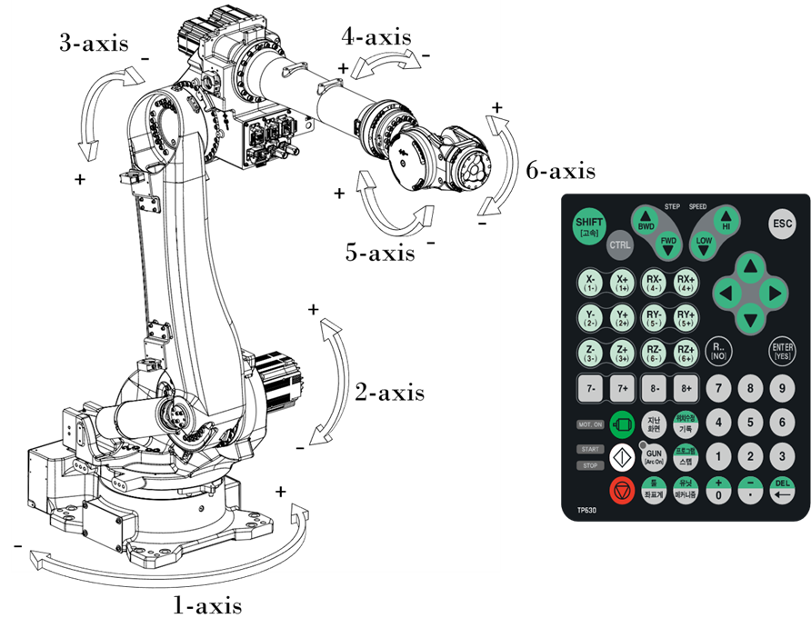

# 2.5. 동작 축 명칭

표 2-2 각 축의 회전 방향
<table>
<thead>
  <tr>
    <th> 축명칭</th>
    <th> 동작</th>
    <th> 티치펜던트 버튼</th>
    <th> </th>
  </tr>
</thead>
<tbody>
  <tr>
    <td> 1-Axis (S)</td>
    <td> 선회</td>
    <td> X+(1+)</td>
    <td> X-(1-)</td>
  </tr>
  <tr>
    <td> 2-Axis (H)</td>
    <td> 전후</td>
    <td> Y+(2+)</td>
    <td> Y-(2-)</td>
  </tr>
  <tr>
    <td> 3-Axis (V)</td>
    <td> 상하</td>
    <td> Z+(3+)</td>
    <td> Z-(3-)</td>
  </tr>
  <tr>
    <td> 4-Axis (R2)</td>
    <td> 회전2</td>
    <td> RX+(4+)</td>
    <td> RX-(4-)</td>
  </tr>
  <tr>
    <td> 5-Axis (B)</td>
    <td> 구부림</td>
    <td> RY+(5+)</td>
    <td> RY-(5-)</td>
  </tr>
  <tr>
    <td> 6-Axis (R1)</td>
    <td> 회전1</td>
    <td> RZ+(6+)</td>
    <td> RZ-(6-)</td>
  </tr>
</tbody>
</table>

그림 2.4 본체 외관 및 동작 축

