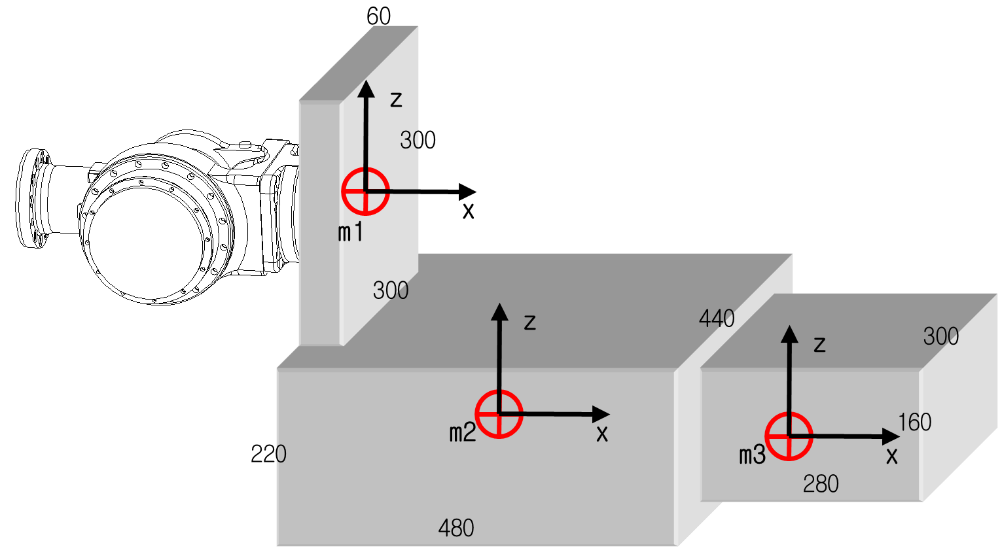

# 3.5.3. 허용 토크, 관성 모멘트 계산 예

(1)	Case #1 간단한 2차원 모델

그림 3.14 2차원 부하 모델

M - 부하 중량

Jxx - 부하 무게중심에서 X축 방향의 관성 모멘트

Jyy - 부하 무게중심에서 Y축 방향의 관성 모멘트

Jzz - 부하 무게중심에서 Z축 방향의 관성 모멘트

Ja4 - 4축 회전 중심에서의 관성 모멘트

Ja5 - 5축 회전 중심에서의 관성 모멘트

Ja6 - 6축 회전중심에서의 관성 모멘트

 
  

  

(2) Case #2 복잡한 3차원 모델

그림 3.15 3차원 부하 모델 2D 형상

그림 3.16 3차원 부하 모델 3D 형상

