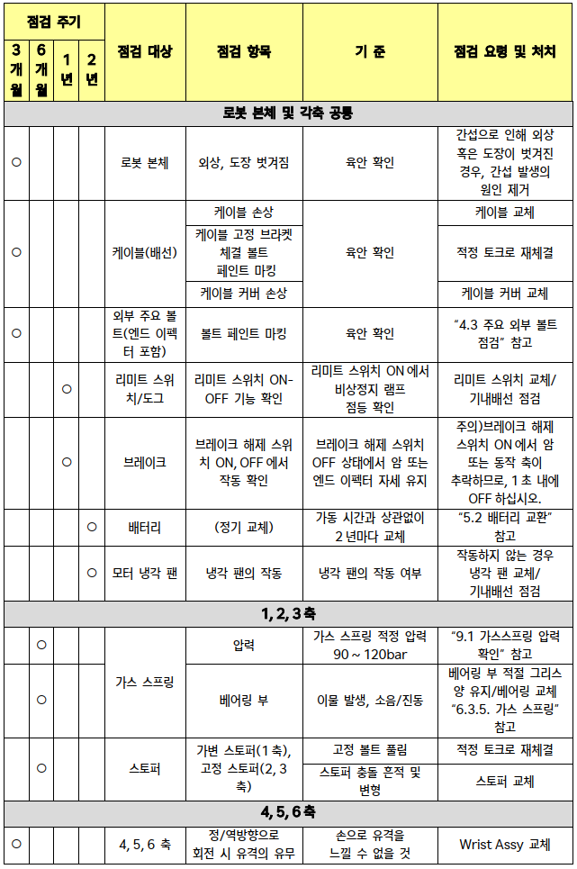

# 4.2. 점검항목과 주기

표 4-2 일상 점검항목
<table>
<thead>
  <tr>
    <th> 점검 대상</th>
    <th> 점검 항목</th>
    <th> 기준</th>
    <th> 점검 요령 및 처치</th>
  </tr>
</thead>
<tbody>
  <tr>
    <td> 로봇 본체</td>
    <td> 로봇 외관</td>
    <td> 누유 및 이물 육안 확인</td>
    <td> 누유 및 이물 제거</td>
  </tr>
  <tr>
    <td> 감속기</td>
    <td> 소음/진동</td>
    <td> 이상 소음/진동 발생 시</td>
    <td> “6.3.1. 감속기” 참고</td>
  </tr>
  <tr>
    <tr>
    <td rowspan="2">모터</td>
    <td>발열</td>
    <td>모터 엔코더 온도 80℃ 이상</td>
    <td rowspan="2">로봇 구동 조건 완화 “6.3.3. 모터” 참고
</td>
    </tr>
    <tr>
    <td>소음/진동</td>
    <td>이상 소음/진동 발생 시</td>
   </tr>
  <tr>
    <td> 티치펜던트</td>
    <td> 화면</td>
    <td> 티치펜던트 화면 상 경고 발생 시</td>
    <td> “Hi6 제어기 조작 설명서메뉴얼” 참고</td>
  </tr>
</tbody>
</table>

 
표 4-3 정기 점검항목과 주기

*	만약 로봇이 악조건(예를 들면, 스폿 용접, 그라인딩 등)에서 사용되고 있다면 로봇 시스템의 성능 확보를 위해 점검 주기를 더욱 짧게 하십시오.

*	동력 전달 장치(모터, 감속기 등)의 이상 유무 확인을 위해, 자동 또는 티칭 모드에서 이상음을 확인하십시오.

*	가스스프링은 적정 사용 압력이 유지되도록 정기 점검을 하고, 압력 저하시 가스를 주입하여 주십시오. 

*	가스스프링은 일정기간 사용 후 교체하여야 합니다. 가스스프링의 교환 시기는 20,000시간 마다 또는 가스 주입 후에도 적정 사용 압력(90~120bar)을 유지할 수 없을 경우로 하여 주십시오.

*	부하 추정이 정확하게 되었을 경우, 가스스프링 압력을 티치 펜던트에서 확인할 수 있으므로, 제어기 기능 설명서의 가스스프링 압력 검사 기능을 참고하여 점검하여 주십시오.
압력 검사 방식은 “명령어 방식 가스스프링 압력 검사”와 “정지 위치 가스스프링 압력 검사” 2가지가 있으며, 정확도가 더 높은 “명령어 방식 가스스프링 압력 검사”로 사용할 것을 권장합니다.

*	티치 펜던트에서 가스스프링 압력 저하 관련 에러 및 경고 발생 시, 반드시 가스스프링 압력을 점검하여 주십시오

