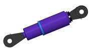
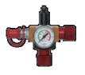
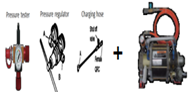
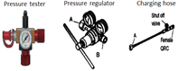
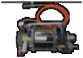
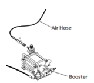

# 9.4.4. 가스 스프링 압력측정 및 가스 충전 부품

표 9-3 가스 스프링 압력측정 및 가스 충전 부품
<table>
<thead>
  <tr>
    <th> 품명규격</th>
    <th> PART NO</th>
    <th> 대당 수량</th>
    <th> 형상</th>
    <th> 공급 구분</th>
  </tr>
</thead>
<tbody>
  <tr>
    <td> GAS SPRING ASSY</td>
    <td> P7000000710 P7000000730</td>
    <td> 1</td>
    <td> </td>
    <td> Hyundai Robotics (옵션)</td>
    </tr>
  <tr>
    <td> PRESSURE TESTER-1 (압력측정용)</td>
    <td> R7900162380</td>
    <td> 1</td>
    <td> </td>
    <td> Hyundai Robotics (옵션)</td>
  </tr>
  <tr>
    <td> REPLENISHING ARMATURE KIT-1 + GAS BOOSTER KIT-1
     1. 질소봄베압력 150bar 이하시 가스 충전용 2. 고객 주문시 포함 항목 
   : 질소봄베 연결부 나사 사양</td>
    <td> R7900164390 R7900162750</td>
    <td> 1</td>
    <td> </td>
    <td> Hyundai Robotics (옵션)</td>
    </tr>
  <tr>
    <td> REPLENISHING ARMATURE KIT-1 1. 질소봄베압력 150bar 초과시    가스 충전용 2. 고객 주문시 포함 항목 : 질소봄베 연결부 나사 사양</td>
    <td> R7900164390</td>
    <td> 1</td>
    <td> </td>
    <td> Hyundai Robotics (옵션)</td>
   </tr>
  <tr>
    <td> GAS BOOSTER KIT-1 1. 질소봄베압력 150bar 이하시 승압용 2. AIR INLET PLUG MALE : R1/4 3. 고객 주문시 포함 항목 : 질소봄베 연결부 나사 사양</td>
    <td> R7900162750</td>
    <td> 1</td>
    <td> </td>
    <td> Hyundai Robotics (옵션)</td>
    </tr>
  <tr>
    <td> Air Hose 및 퀵커플링 (Air 공급용)</td>
    <td> -</td>
    <td> 1</td>
    <td> </td>
    <td> 고객</td>
  </tr>
</tbody>
</table>