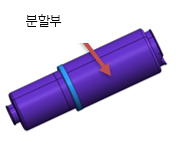
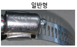

# 9.4.5. 가스스프링 보호커버

<table>
<thead>
  <tr>
    <th> 구분</th>
    <th> 플라스틱 커버</th>
    <th> 비고</th>
    </tr>
</thead>
<tbody>
  <tr>
    <td> 외관</td>
    <td> </td>
    <td> </td>
     </tr>
  <tr>
    <td> 재질</td>
    <td> PLASTIC(분할형)</td>
    <td> </td>
  </tr>
   <tr>
    <td> 보호 커버 교체 시 가스스프링 분해</td>
    <td> X</td>
    <td> </td>
     </tr>
  <tr>
    <td> CLAMP 사양</td>
    <td> ○ 소 : 12W x Φ54 ○ 대 : 12W x Φ103 ○ 렌치크기 : 8mm ○ 체결토크 : 60kg/㎠ </td>
    <td> </td>
  </tr>
   <tr>
    <td> CLAMP 이미지</td>
    <td> </td>
    <td> </td>
     </tr>
  <tr>
    <td> 교체시점</td>
    <td> 외부 충격에 의한 파손시</td>
    <td> </td>
  </tr>
  <tr>
    <td> 조립시 주의사항</td>
    <td> 분할부 틈새 없도록 조립</td>
    <td> </td>
  </tr>
  </tbody>
</table>
