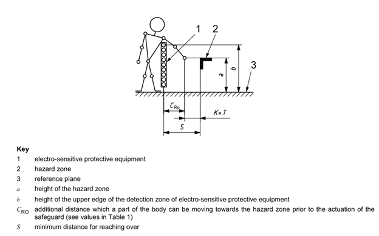
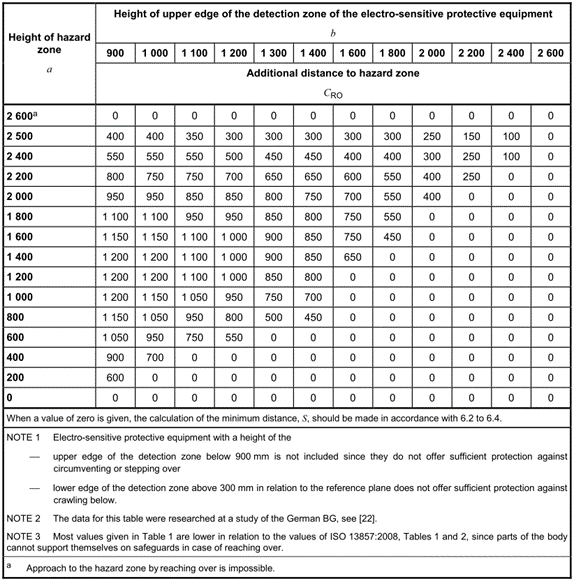

# 1.10.1. 안전 가드 설치

<table class="tg">
<thead>
  <tr>
    <td class="tg-e3v1"> 경고</td>
    <td class="tg-cly1">로봇 동작시 로봇과 작업자가 충돌할 위험이 있기 때문에 작업자가 로봇과 가까이하지 않도록 안전망을 설치하여 주십시오.</td>
  </tr>
</thead>
</table>

로봇 동작시 로봇과 작업자가 충돌할 위험이 있기 때문에 작업자가 로봇과 가까이 하지 않도록 ISO 13855:2010를 준수하여 안전망을 설치하여 주십시오. 로봇이나 용접치구의 점검, 또는 팁 드레싱(tip dressing), 팁교환(tip changing) 등 어떠한 이유든지 로봇동작 중에 안전망(fence)의 문을 열고 설비에 접근하면 로봇이 정지하도록 구성하여 주십시오.

그림 1.12 안전펜스 연결

출처: ISO 13855:2010 Safety of machinery — Positioning of safeguards with respect to the approach speeds of parts of the human body

표 1-1 안전펜스 설치 규격

출처: ISO 13855:2010 Safety of machinery - Positioning of safeguards with respect to the approach speeds of parts of the human body

* 안전망은 로봇 동작영역을 커버하며, 작업자가 티칭(teaching) 작업 및 보수작업 등에 지장이 없도록 충분한 공간을 확보하여야 하며, 쉽게 이동시키지 못하도록 견고하게 하고, 사람들이 쉽게 넘어 들어가지 못하는 구조로 하여 주십시오.

* 안전망은 원칙적으로 고정식으로 설치해야 하며 요철 또는 예리한 부위 등의 위험부분이 없는 것을 사용하여 주십시오.

* 안전망 안으로 출입이 가능하도록 출입문을 설치하고, 출입문에는 안전플러그를 반드시 설치하여 플러그를 뽑지 않으면 문이 열리지 않도록 합니다. 또 안전플러그를 뽑거나 안전망이 열린 상태에서는 로봇이 모터OFF/브레이크 Hold가 되도록 배선해 주십시오.

* 안전플러그를 뽑은 상태에서 로봇을 동작하고자 할 경우에는 저속으로 재생 되도록 배선하여 주십시오.

* 로봇의 비상정지 버튼은 작업자가 빠르게 누를 수 있는 곳에 설치하여 주십시오.

* 안전망을 설치하지 않은 경우에는 안전플러그를 대신할 수 있도록, 로봇의 안전가드 범위의 사양 내에 들어가는 장소 전체에 광전스위치, 매트스위치 등과 같은 안전 장치를 설치하여, 사람이 진입하였을 때 로봇이 자동으로 정지하도록 해주십시오.

* 로봇의 동작영역(위험영역)은 바닥에 페인트 칠을 하는 것과 같이 식별될 수 있도록 하여 주십시오.
