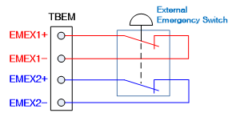

# 1.8.1. 주요 안전 기능

* 비상정지 (IEC 60204-1,10,7)

   제어기와 티칭펜던트에 각각 비상정지 버튼이 한 개씩 있으며, 필요에 따라 추가로 비상정지 입력을 로봇의 안전 체인 회로에 연결할 수 있습니다. 비상정지 기능은 로봇의 모든 제어 기능보다도 우선적으로 적용되는 기능입니다. 로봇 각축 모터에 공급되는 전원을 즉각 차단하여 로봇을 정지시키며, 로봇에 의하여 제어되는 안전에 관련된 기능들을 사용하지 못하도록 합니다.

<table class="tg">
<thead>
  <tr>
    <td class="tg-b001"> 주의</td>
    <td class="tg-cly1">비상정지는 모터 동력을 즉각 차단하므로, 무분별한 사용은 로봇 내구성에 피로가 누적될 수 있습니다. 반드시, 비상상황에서만 사용하시기 바랍니다.</td>
  </tr>
</thead>
</table>

그림 1.10 제어기, 티치펜던트 비상정지 스위치

그림 1.11 추가 비상정지 장치 연결

* 보호정지 (ISO 10218-1:2011)

   로봇은 안전가드, 안전패드, 안전등과 같은 외부의 안전장치와 연결되어 사용할 수 있도록 다수의 안전입력을 가져야합니다. 이러한 안전입력은 로봇자체 및 주변설비 등으로부터 입력시 로봇을 정지시키므로서, 안전한 상태가 되도록 합니다. 자세한 안전입력에 대한 연결에 대해서는 “4.3.2.안전모듈(BD632)”을 참고하시기 바랍니다.

* 속도제한기능(EN ISO 10218-1:2011)

   수동조작 모드에서 로봇의 속도는 최고 250 mm/s로 제한됩니다. 속도의 제한은 TCP(Tool Centre Point) 뿐만 아니라 수동조작을 행하는 로봇의 모든 부분에 적용됩니다. 또한 로봇에 장착된 장비의 속도는 모니터링이 가능하도록 해야 합니다.

* 동작영역제한(ANSI/RIA R15.06-2012)

   로봇을 적용할 때 충분한 안전영역을 확보하기 위하여 로봇의 동작범위를 하드웨어리미트(Hardware limit), 스토퍼(Stopper)을 사용하여 제한 할 수 있습니다. 안전가드 등과 같은 외부 안전 장치와 로봇이 충돌할 경우 이런 기능은 손해를 최소화 할 것입니다. 1,2,3축은 주로 스토퍼나 하드웨어리미트에 의해 동작 범위가 제한됩니다. 만약 기계적인 스토퍼 또는 하드웨어리미트에 의하여 동작범위가 변경될 경우는 소프트웨어 상에서도 동작영역 한계 파라미터가 변경되어야 합니다. 변경에 대한 사항은 조작메뉴얼을 참고하시기 바랍니다. 각축의 동작영역의 한계는 사용자에 의해 변경이 가능하며, 출하시에는 로봇의 최대 동작영역으로 설정되어 있습니다. Hi6제어기의 안전시스템은 하드웨어리미트 스위치를 옵션으로 4개까지 지원 가능하며, 연결과 관련된 사항은 “4.3.2. 안전모듈(BD632)”을 참고하시기 바립니다.

* 조작모드의 선택(ANSI/RIA R15.06-2012)

   로봇은 수동 또는 자동, 리모트모드에서 조작할 수 있습니다. 수동모드에서의 최고 속도는 250 mm/s로 제한되며, 티칭펜던트를 통해서만 조작이 가능합니다. 또한 옵션 구성에 의해 제어반에 모드스위치의 추가장착이 가능합니다. 조작에 관한 상세 내용은 조작 매뉴얼을 참고하시기 바랍니다.
