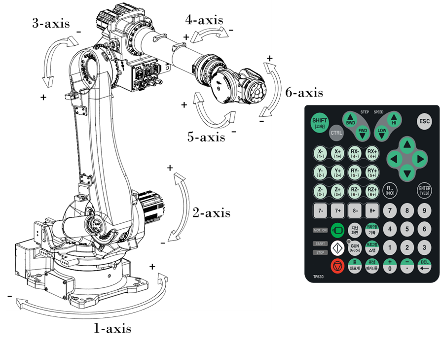

# 2.5. 동작 축 명칭

표 2-2 각 축의 회전 방향

<table class="tg">
<thead>
  <tr>
    <th class="tg-yhpm">축명칭</th>
    <th class="tg-yhpm">동작</th>
    <th class="tg-yhpm" colspan="2">티치펜던트 버튼</th>
  </tr>
</thead>
<tbody>
  <tr>
    <td class="tg-lput">1-Axis (S)</td>
    <td class="tg-nrix">선회</td>
    <td class="tg-nrix">X+(1+)</td>
    <td class="tg-nrix">X-(1-)</td>
  </tr>
  <tr>
    <td class="tg-lput">2-Axis (H)</td>
    <td class="tg-nrix">전후</td>
    <td class="tg-nrix">Y+(2+)</td>
    <td class="tg-nrix">Y-(2-)</td>
  </tr>
  <tr>
    <td class="tg-lput">3-Axis (V)</td>
    <td class="tg-nrix">상하</td>
    <td class="tg-nrix">Z+(3+)</td>
    <td class="tg-nrix">Z-(3-)</td>
  </tr>
  <tr>
    <td class="tg-lput">4-Axis (R2)</td>
    <td class="tg-nrix">회전2</td>
    <td class="tg-nrix">RX+(4+)</td>
    <td class="tg-nrix">RX-(4-)</td>
  </tr>
  <tr>
    <td class="tg-lput">5-Axis (B)</td>
    <td class="tg-nrix">구부림</td>
    <td class="tg-nrix">RY+(5+)</td>
    <td class="tg-nrix">RY-(5-)</td>
  </tr>
  <tr>
    <td class="tg-lput">6-Axis (R1)</td>
    <td class="tg-nrix">회전1</td>
    <td class="tg-nrix">RZ+(6+)</td>
    <td class="tg-nrix">RZ-(6-)</td>
  </tr>
</tbody>
</table>

그림 2.4 본체 외관 및 동작 축

