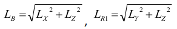
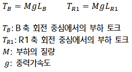

# 3.5.1. 허용 부하 토크 산정

로봇의 손목축 선단에 부착될 부하는 허용 중량, 허용 부하토크, 허용 관성 모멘트에 의해서 규제 됩니다. 부하 토크 및 관성 모멘트 계산 시 사용되는 좌표계의 방향은 로봇 베이스 좌표계의 방향과 동일합니다. R2축에 대한 검토는 B축과 동일한 방식으로 이루어집니다.

*	Step 1

    B축 회전 중심에서의 무게 중심의 위치를 계산 (LX, LY, LZ.)

    Lx: X축 방향 무게중심 위치

    Ly: Y축 방향 무게중심 위치

    Lz: Z축 방향 무게중심 위치

*	Step 2

    B축, R1축에서부터 무게 중심까지 거리 계산

    

    LB : 5축 회전 중심에서 무게중심까지의 거리

    LR1 : 6축 회전 중심에서 무게중심까지의 거리

*	Step 3

    계산된 거리로부터 부하 토크를 계산

    

*	Step 4

    허용 부하 토크 표를 기준으로 Step 3에서 계산된 부하 토크가 제한치 이하인지 확인

 
* Note : 부하 질량이 하기의 토크 선도 상의 질량과 유사할 경우, 부하 토크 검증은 Step 3,4 대신 Step 2에서 계산된 거리가 토크 선도 내에 분포하는지 체크함으로 대체할 수 있습니다. 토크 선도 내에 위치할 경우, 계산된 부하 토크가 허용 부하 토크 이내이며, 토크 선도 밖에 위치할 경우, 계산된 부하 토크는 허용 부하 토크 초과를 의미 합니다.

 

그림 3.13 손목축 토크 선도
  

 <b>허용 부하 토크</b>

표 3-1 허용 부하 토크

<table class="tg">
<thead>
  <tr>
    <th class="tg-zegx" rowspan="2">로봇모델</th>
    <th class="tg-zegx" colspan="3">허용 부하 토크</th>
  </tr>
  <tr>
    <th class="tg-zegx">4축</th>
    <th class="tg-zegx">5축</th>
    <th class="tg-zegx">6축</th>
  </tr>
</thead>
<tbody>
  <tr>
    <td class="tg-nrix">US220</td>
    <td class="tg-nrix" colspan="2">1422 N·m(145kgf·m) 이내</td>
    <td class="tg-nrix">770 N·m(79 kgf·m) 이내</td>
  </tr>
</tbody>
</table>
