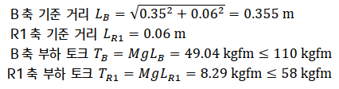
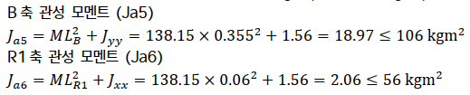
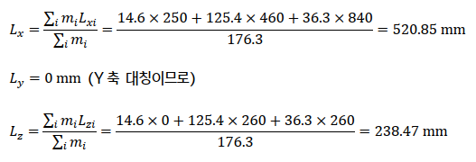
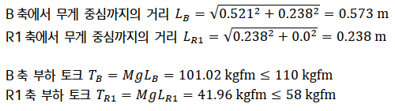
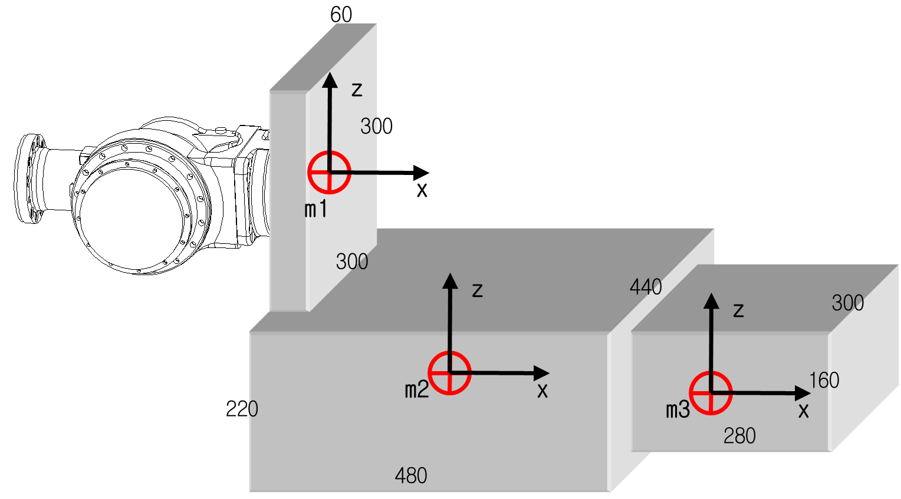
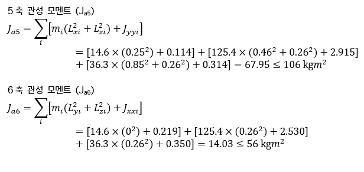

# 3.6.3. 허용 토크, 관성 모멘트 계산 예(HS180 Case)

(1)	Case #1 간단한 2차원 모델

그림 3.14 2차원 부하 모델

M - 부하 중량

Jxx - 부하 무게중심에서 X축 방향의 관성 모멘트

Jyy - 부하 무게중심에서 Y축 방향의 관성 모멘트

Jzz - 부하 무게중심에서 Z축 방향의 관성 모멘트

Ja4 - R2축 회전 중심에서의 관성 모멘트

Ja5 - B축 회전 중심에서의 관성 모멘트

Ja6 - R1축 회전중심에서의 관성 모멘트

 
  
☞ 부하조건: 가로, 세로 260mm, 두께 260mm 의 Stainless Steel (Mass 138.15kg)

① 중량제한

부하 중량: 138.15 ≤ 180 kg

    

② 허용 토크 제한

B축 기준 무게중심 위치 LX = 350mm, LY = 0mm, LZ = -60mm

B, R1축에서 무게중심까지의 거리를 계산하면 아래와 같습니다.

 

③ 허용 관성모멘트 제한

무게중심에서 부하의 관성 모멘트  Jxx= 1.56kgm², Jyy= 1.56 kgm², Jzz= 1.56 kgm²

 
  
④ 결론

중량, 토크, 관성모멘트 조건 모두 제한 조건을 만족하므로 안전합니다.

  

(2) Case #2 복잡한 3차원 모델

그림 3.15 3차원 부하 모델 2D 형상

  

알루미늄 블록 형상 조합
(σ=0.0027 g/mm3 : 176.3 kg)

m1 (60×300×300)	 14.6kg

m2 (480×440×220)	125.4kg

m3 (280×300×160)	 36.3kg

 

mi  - i 블록 부하 중량

Lxi - i 블록 X축 방향 무게중심 위치

Lyi - i 블록 Y축 방향 무게중심 위치

Lzi - i 블록 Z축 방향 무게중심 위치

 

① 중량 제한

부하 중량: 176.3 ≤180 kg

 

② 허용 토크 제한

B축 회전 중심에서 전체 부하의 무게중심 위치를 구하면 아래와 같습니다.

 

블록 전체 B축 기준 무게중심 위치 Lx = 520.85mm, Ly = 0mm, Lz= -238.47mm

 

 

x1 y1 z1 – m1 블록의 x, y, z 방향 길이

x2 y2 z2 – m2 블록의 x, y, z 방향 길이

x3 y3 z3 – m3 블록의 x, y, z 방향 길이

 

LX1, LY1, LZ1 - B축 회전 중심에서 m1 블록 무게중심 위치

LX2, LY2, LZ2 - B축 회전 중심에서 m2 블록 무게중심 위치

LX3, LY3, LZ3 - B축 회전 중심에서 m3 블록 무게중심 위치

 

Jxx1, Jyy1, Jzz1 – m1 블록 무게중심에서의 x, y, z 축 별 관성모멘트

Jxx2, Jyy2, Jzz2 – m2 블록 무게중심에서의 x, y, z 축 별 관성모멘트

Jxx3, Jyy3, Jzz3 – m3 블록 무게중심에서의 x, y, z 축 별 관성모멘트

그림 3.16 3차원 부하 모델 3D 형상

 

③  허용 관성모멘트 제한

표 3-3 블록별 무게중심에서의 관성 모멘트

<table class="tg">
<thead>
  <tr>
    <th class="tg-1e26">블록 무게(kg)</th>
    <th class="tg-1e26">무게 중심(LX, LY, LZ)</th>
    <th class="tg-1e26">Jxx</th>
    <th class="tg-1e26">Jyy</th>
    <th class="tg-1e26">Jzz</th>
  </tr>
</thead>
<tbody>
  <tr>
    <td class="tg-amwm">m1(14.6)</td>
    <td class="tg-baqh">(0.25, 0, 0)</td>
    <td class="tg-baqh">0.219 kgm²</td>
    <td class="tg-baqh">0.114 kgm²</td>
    <td class="tg-baqh">0.114 kgm²</td>
  </tr>
  <tr>
    <td class="tg-amwm">m2(125.4)</td>
    <td class="tg-baqh">(0.48, 0, -0.26)</td>
    <td class="tg-baqh">2.530 kgm²</td>
    <td class="tg-baqh">2.915 kgm²</td>
    <td class="tg-baqh">4.433 kgm²</td>
  </tr>
  <tr>
    <td class="tg-amwm">m3(36.3)</td>
    <td class="tg-baqh">(0.89, 0, -0.26)</td>
    <td class="tg-baqh">0.350 kgm²</td>
    <td class="tg-baqh">0.314 kgm²</td>
    <td class="tg-baqh">0.509 kgm²</td>
  </tr>
</tbody>
</table>

 

 

④ 결론

중량, 토크, 관성모멘트 조건 모두 제한 조건을 만족하므로 안전합니다. 
