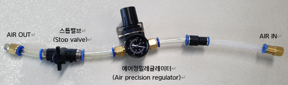

# 5.1.8. 그리스 배출 순서

(1)	주입된 그리스량과 배출된 그리스량의 차이를 확인한 후, 배출해야 할 그리스량을 결정하여 주십시오.

(2)	로봇 동작 시 주변 설비등과 간섭 없도록 자세를 이동하여 주십시오.

(3)	주변 오염이 되지 않도록 그리스 주입구에 개방된 비닐등의 그리스 받이를 부착하여 주십시오.

(4)	그리스 받이의 크기는 배출될 그리스 량을 감안한 크기로 준비하여 주십시오.

(5)	그리스 배출구에 0.025Mpa로 조정된 에어 정밀 레귤레이터(Air precision regulator) 세트(Set)를 장착하여 주십시오.

에어 정밀 레귤레이터 세트는 에어 호스(Air hose)와 스톱밸브(Stop valve), 피팅(Male Push to Connect Fittings)로 구성하며, 장착 전 스톱밸브를 열고 닫으며 지시된 압력을 초과하지 않도록 확인한 후, 스톱밸브 손잡이를 공기가 공급되지 않도록 잠금(Stop) 상태로 위치시켜 주십시오.

(6)	그리스 배출 시 급유부 압력이 0.025Mpa가 초과하지 않도록 주의하여 주십시오.

(7)	그리스가 배출될 주입구의 플러그가 제거 되었는지 확인하여 주십시오.

(8)	스톱밸브를 열어 그리스가 공기 압력에 의해 배출되도록 하고, 배출된 양을 확인하여 주십시오.

(9)	배출량이 부족할 경우 로봇을 서서히 회전시키면서, 그리스가 쉽게 배출되도록 하여 주십시오.

(10) 그리스 배출이 완료되면, 그리스 받이와 레귤레이터 세트를 제거하여 주십시오.

(11) 깨끗한 헝겊으로 주입구와 배출구 주변에 오염된 그리스를 제거하여 주십시오.

(12) 배출구와 주입구에 플러그를 체결하여 주십시오.

<table class="tg">
<thead>
  <tr>
    <td class="tg-e3v1"> 경고</td>
    <td class="tg-cly1">그리스가 주입된 감속기부 등의 그리스 통(Barrel) 내부에 너무 높은 공기 압력이 공급되면 갑자기 그리스가 분출되는 위험이 있습니다. 반드시 그리스 배출구에서 나오는 그리스가 그리스 받이로만 배출되도록 덮어 주십시오. 그리스 배출 작업 시 복장은 보호안경, 얼굴 보안면, 보호복장 등의 안전 복장을 착용하여 주십시오.

    
그리스 통 내부의 압력은 0.025Mpa가 초과되지 않도록, 그리스 통에 장착 전  0Mpa부터 서서히 0.025Mpa까지 압력을 올려가며 세팅하고, 스톱밸브를 수 회 열고 닫으며 설정 압력이 적절한지 확인한 후, 그리스 통의 배출구에 장착하여 주십시오. 장착 후 스톱밸브를 열고 닫아 압력이 적절한지 한번 더 확인하여 주십시오.
</td>
  </tr>
</thead>
</table>

 

