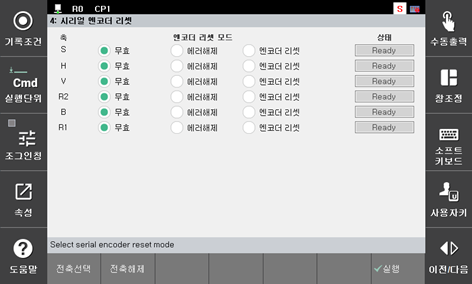

# 6.5.2. 엔코더 리셋

(1)	모터를 OFF하십시오.

(2)	시리얼 엔코더 리셋 설정화면으로 진입합니다. (『[F2]: 시스템』 → 『5: 초기화』 → 『4: 시리얼 엔코더 리셋』)

 
그림 6.4 시리얼 엔코더 리셋

(3)	[↓],[↑]키를 조작하여 해당 축으로 이동한 다음, [Shift]+[←][→]키를 조작하여 [엔코더 리셋]으로 설정하고, 실행을 클릭합니다.

(4)	엔코더 리셋 후에는 반드시 제어기 전원을 OFF → ON 해야 합니다.
