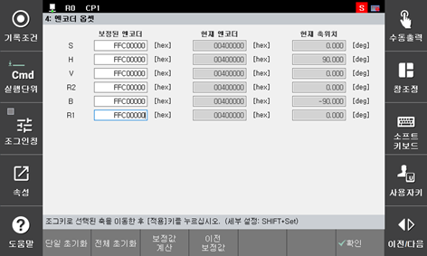

# 6.5.3. 엔코더 보정 및 선택

*	로봇 각 축의 기준 위치에 엔코더 DATA의 보정 작업이 필요합니다.
*	제어기 조작설명서『엔코더 보정』을 참조해서, 엔코더 보정을 해주십시오.

[엔코더 보정화면]

그림 6.5 엔코더 보정

(1)	축을 선택하고 [축조작]키로 기준위치로 축을 이동시키고 『[F1]: 단일 초기화』키를 누릅니다.

(2)	로봇 전축을 [축조작]키를 이용하여 기준자세로 위치시키고 『[F2]: 전체 초기화』키를 누르면 모든 축에 대해 한번에 엔코더 옵셋 보정이 수행됩니다.

(3)	설정 데이터를 저장하기 위해서는 『[F7]: 확인』키를 누릅니다. [ESC]키를 누르면 변경된 데이터가 저장되지 않습니다.

<table class="tg">
<thead>
  <tr>
    <td class="tg-b001"> 주의</td>
    <td class="tg-cly1">모터 교환 후, 엔코더 DATA 보정을 행하는 경우, 일단 전원 준비를 『ON』상태로 해서 모터에 전원이 들어가는지를 확인해 주십시오.</td>
  </tr>
</thead>
</table>

