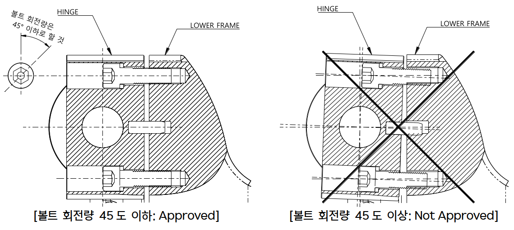

# 8.2.1. 가스 스프링의 분리

로봇은 반드시 그림 8.1과 같은 자세에 위치한 후 가스스프링을 분리하여 주십시오. 해당 자세는 가스 스프링의 압축력이 최소화되어 로봇에서 분리가 가능한 자세입니다. 
단, 가스 스프링 폐기나 내부 수리를 위해서 분리할 경우에는 가스 스프링의 Gas 배출 절차에 따라 가스를 완전히 제거한 후 분리하여 주시기 바랍니다.

그림 8.1 가스 스프링 조립, 해체 및 유지보수 시 자세

<table class="tg">
<thead>
  <tr>
    <th class="tg-baqh">1- Axis</th>
    <th class="tg-baqh">0</th>
  </tr>
</thead>
<tbody>
  <tr>
    <td class="tg-baqh">2- Axis</td>
    <td class="tg-baqh">90</td>
  </tr>
  <tr>
    <td class="tg-baqh">3- Axis</td>
    <td class="tg-baqh">0</td>
  </tr>
  <tr>
    <td class="tg-baqh">4- Axis/td>
    <td class="tg-baqh">0</td>
  </tr>
  <tr>
    <td class="tg-baqh">5- Axis</td>
    <td class="tg-baqh">0</td>
  </tr>
  <tr>
    <td class="tg-baqh">6- Axis</td>
    <td class="tg-baqh">0</td>
  </tr>
</tbody>
</table>

<table class="tg">
<thead>
  <tr>
    <td class="tg-b001"> 주의</td>
    <td class="tg-cly1">가스 스프링의 조립 및 분리 시 그림 8.2과 같이 HINGE가 과다하게 기울어지지 않도록, 상/하측 볼트를 번갈아 가며 45도 이하로 회전 하여 체결 혹은 분해하여 주십시오. 
HINGE가 과다하게 기울어질 경우 볼트를 손상시키고, 손상된 볼트는 FRAME의 TAP까지 손상시켜서 분해/조립을 어렵게 합니다. 
HINGE등 각 부품의 형상은 별도 고지 없이 변경될 수 있습니다.
</td>
  </tr>
</thead>
</table>

그림 8.2 가스스프링 힌지 고정볼트 분해 시 주의사항