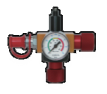
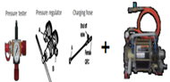
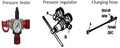
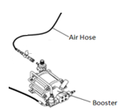

# 9.4.4. 가스 스프링 압력측정 및 가스 충전 부품

표 9-3 가스 스프링 압력측정 및 가스 충전 부품

<table class="tg">
<thead>
  <tr>
    <th class="tg-amwm">품명규격</th>
    <th class="tg-amwm">PART NO</th>
    <th class="tg-amwm">대당 수량</th>
    <th class="tg-amwm">형상</th>
    <th class="tg-amwm">공급 구분</th>
  </tr>
</thead>
<tbody>
  <tr>
    <td class="tg-baqh">GAS SPRING ASSY</td>
    <td class="tg-baqh">P7000000710 P7000000730</td>
    <td class="tg-baqh">1</td>
    <td class="tg-baqh"></td>
    <td class="tg-baqh">Hyundai Robotics (옵션)</td>
  </tr>
  <tr>
    <td class="tg-baqh">PRESSURE TESTER-1 (압력측정용)</td>
    <td class="tg-baqh">R7900162380</td>
    <td class="tg-baqh">1</td>
    <td class="tg-baqh"></td>
    <td class="tg-baqh">Hyundai Robotics (옵션)</td>
  </tr>
  <tr>
    <td class="tg-baqh">REPLENISHING ARMATURE KIT-1
+ GAS BOOSTER KIT-1
1. 질소봄베압력 150bar 이하시 가스 충전용 
2. 고객 주문시 포함 항목 : 질소봄베 연결부 나사 사양
</td>
    <td class="tg-baqh">R7900164390 R7900162750</td>
    <td class="tg-baqh">1</td>
    <td class="tg-baqh"></td>
    <td class="tg-baqh">Hyundai Robotics (옵션)</td>
  </tr>
  <tr>
    <td class="tg-baqh">REPLENISHING ARMATURE KIT-1 
1. 질소봄베압력 150bar 초과시 가스 충전용 
2. 고객 주문시 포함 항목 : 질소봄베 연결부 나사 사양
</td>
    <td class="tg-baqh">R7900164390</td>
    <td class="tg-baqh">1</td>
    <td class="tg-baqh"></td>
    <td class="tg-baqh">Hyundai Robotics (옵션)</td>
  </tr>
  <tr>
    <td class="tg-baqh">GAS BOOSTER KIT-1 
1. 질소봄베압력 150bar 이하시 승압용 
2. AIR INLET PLUG MALE : R1/4 
3. 고객 주문시 포함 항목
   : 질소봄베 연결부 나사 사양
</td>
    <td class="tg-baqh">R7900162750</td>
    <td class="tg-baqh">1</td>
    <td class="tg-baqh"></td>
    <td class="tg-baqh">Hyundai Robotics (옵션)</td>
  </tr>
  <tr>
    <td class="tg-baqh">Air Hose 및 퀵커플링 (Air 공급용)</td>
    <td class="tg-baqh">-</td>
    <td class="tg-baqh">1</td>
    <td class="tg-baqh"></td>
    <td class="tg-baqh">고객</td>
  </tr>
</tbody>
</table>
