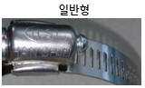

# 9.4.5. 가스스프링 보호커버

<table class="tg">
<thead>
  <tr>
    <th class="tg-wa1i">구분</th>
    <th class="tg-wa1i">플라스틱 커버</th>
    <th class="tg-wa1i">비고</th>
  </tr>
</thead>
<tbody>
  <tr>
    <td class="tg-wa1i">외관</td>
    <td class="tg-nrix"></td>
    <td class="tg-nrix"></td>
  </tr>
  <tr>
    <td class="tg-wa1i">재질</td>
    <td class="tg-nrix">PLASTIC(분할형)</td>
    <td class="tg-nrix"></td>
  </tr>
  <tr>
    <td class="tg-wa1i">보호 커버 교체 시 가스스프링 분해</td>
    <td class="tg-nrix">X</td>
    <td class="tg-nrix"></td>
  </tr>
  <tr>
    <td class="tg-wa1i">CLAMP 사양</td>
    <td class="tg-nrix">○ 소 : 12W x Φ54 ○ 대 : 12W x Φ103 ○ 렌치크기 : 8mm ○ 체결토크 : 60kg/㎠</td>
    <td class="tg-nrix"></td>
  </tr>
  <tr>
    <td class="tg-wa1i">CLAMP 이미지</td>
    <td class="tg-nrix"></td>
    <td class="tg-nrix"></td>
  </tr>
  <tr>
    <td class="tg-wa1i">교체시점</td>
    <td class="tg-nrix">외부 충격에 의한 파손시</td>
    <td class="tg-nrix"></td>
  </tr>
  <tr>
    <td class="tg-wa1i">조립시 주의사항</td>
    <td class="tg-nrix">분할부 틈새 없도록 조립</td>
    <td class="tg-nrix"></td>
  </tr>
</tbody>
</table>
